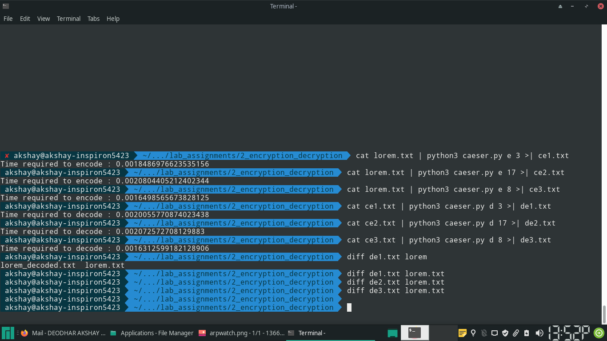

# Caeser Cipher

## Code

\small
```{.py .numberLines startFrom="1"}

from sys import stdin, argv, stderr
import time

def caeserify(c, shift):
    if c.isalpha():
        if c.islower():
            base = ord('a')
        else:
            base = ord('A')

        return chr(base + ((ord(c) - base) + shift) % 26)

    else:

        return c


def encode(s, shift):

    def shifter(c):
        return caeserify(c, shift)

    res = ""
    for c in s:
        cdash = caeserify(c, shift)
        res += cdash

    return res

if __name__ == "__main__":

    n = len(argv)
    if n != 3:
        print("usage: python3 caeser.py <mode> <shift>", file = stderr)
        exit(1)
    __, mode, shift = argv

    if mode not in ['e', 'd']:
        print("<mode> must be in {e, d}", file = stderr)
        exit(1)

    shift = int(shift)

    if mode == 'd':
        # encoding and decoding are the same, but with reverse rotation
        shift = -shift
        phrase = 'decode'
    else:
        phrase = 'encode'

    iptext = stdin.read()

    t1 = time.time()
    optext = encode(iptext, shift) 
    t2 = time.time()

    print(optext, end = "")

    print("Time required to", phrase, ":", t2 - t1, file = stderr)

```
\normalsize

## Output



## Statistics

- The size of file used for encryption and decryption is **3.4KB**.
- The average time required for encryption was **0.00181s**
- The average time needed for decryption was **0.00186s**

# Monosubstitution Cipher

## Code

\small
```{.py .numberLines startFrom="1"}

from sys import stdin, argv, stderr
import time

def flipkey(key):

    newkey_list = [None] * 26

    base = ord('a')
    for i, c in enumerate(key):
        newkey_list[ord(c) - base] = chr(base + i)

    return "".join(newkey_list)

def transform(c, key):
    if c.isalpha():
        if c.isupper():
            return key[ord(c.lower()) - ord('a')].upper()
        else:
            return key[ord(c) - ord('a')]
    else:
        return c

def encode(s, key):

    def transform_with_key(s):
        return transform(s, key)

    res = ""
    for c in s:
        cdash = transform(c, key)
        res += cdash

    return res


if __name__ == "__main__":

    n = len(argv)
    if n != 3:
        print("usage: python3 monosubstution.py <mode> <shift>", file = stderr)
        exit(1)
    __, mode, key = argv

    if mode not in ['e', 'd']:
        print("<mode> must be in {e, d}", file = stderr)
        exit(1)

    if mode == 'd':
        # encoding and decoding are the same, but with reverse rotation
        key = flipkey(key)
        phrase = 'decode'
    else:
        phrase = 'encode'

    iptext = stdin.read()

    t1 = time.time()
    optext = encode(iptext, key) 
    t2 = time.time()

    print(optext, end = "")

    print("Time required to", phrase, ":", t2 - t1, file = stderr)
```
\normalsize

## Output


## Statistics

- The size of the file used for encryption was **3.4KB**
- The average time required for encryption, using three different keys was
  **0.00146s**
- The average time required for decryption, using three different keys was
  **0.00180s**0.00180s**0.00180s**
