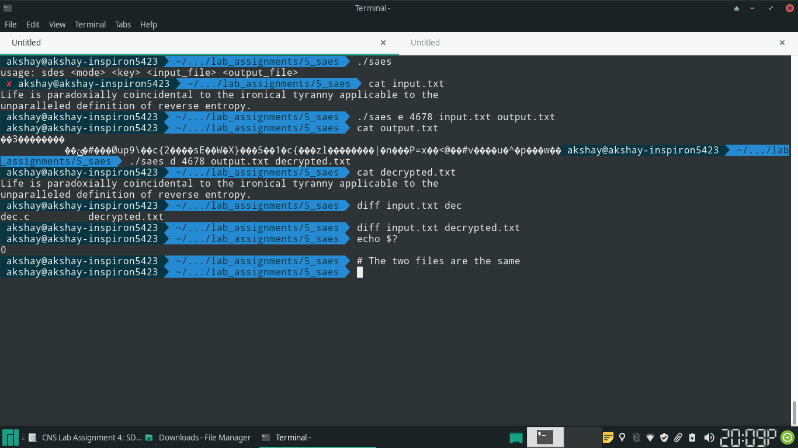
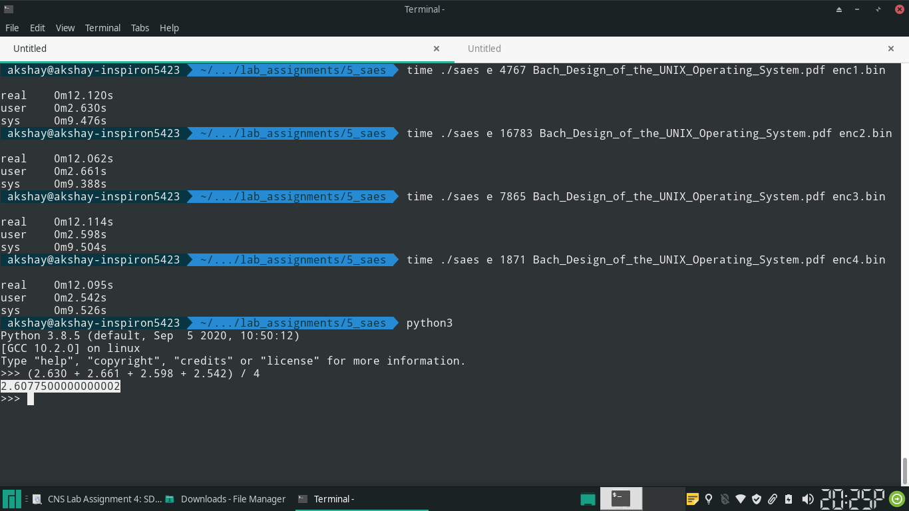
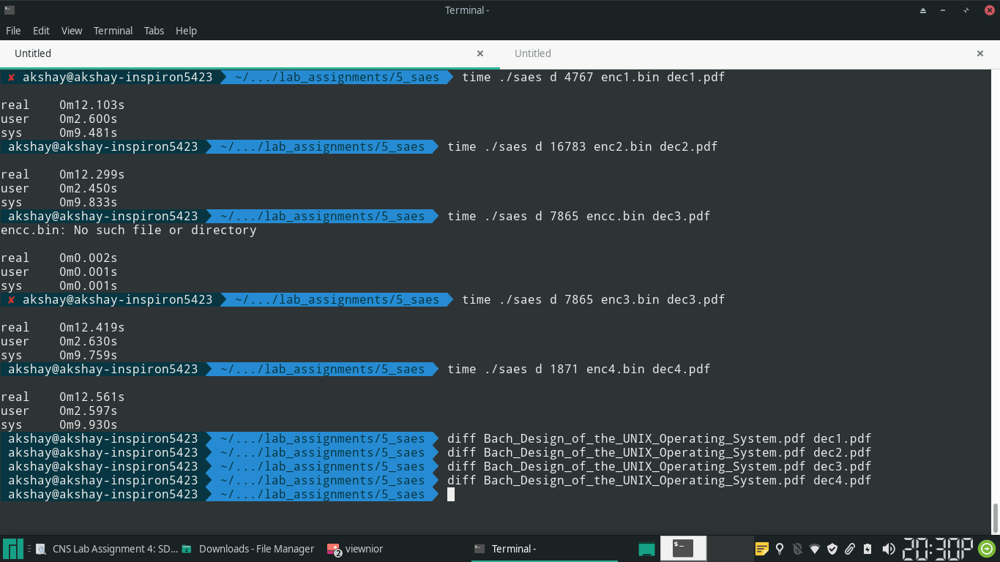
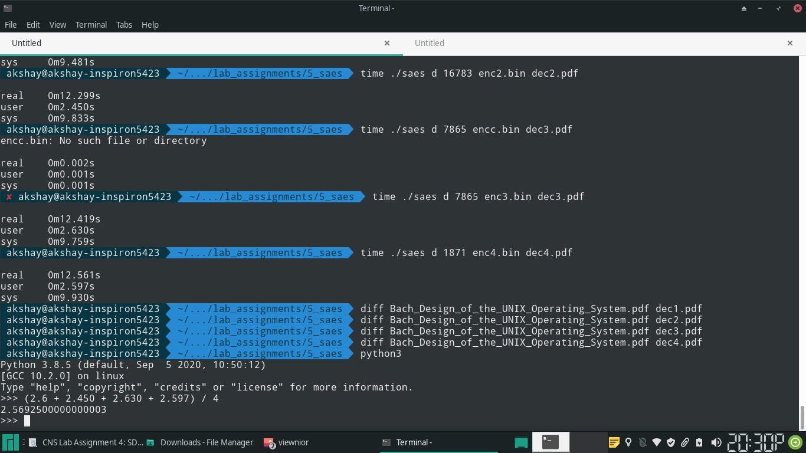

## Code

\small

```{.c .numberLines startFrom="1"}

#include <sys/types.h>
#include <unistd.h>
#include <fcntl.h>
#include <errno.h>
#include <stdio.h>
#include <stdlib.h>
#include <stdint.h>

#define DEBUG_MODE 0
#if DEBUG_MODE
#define DEBUGPRINT(token) {printf(#token ": %x\n", token);}
#else
#define DEBUGPRINT(token) {;}
#endif


typedef uint8_t u8;

typedef uint16_t u16;

typedef uint32_t u32;

static u16 subkeys[3];

/* S-box */
static u16 S[] = {9, 4, 10, 11, 13, 1, 8, 5, 6, 2, 0, 3, 12, 14, 15, 7};

/* Inverse S-box */
static u16 invS[] =  {10, 5, 9, 11, 1, 7, 8, 15, 6, 0, 2, 3, 12, 4, 13, 14};

/* row indicates the multiplyer specified by AES
 * col is the dataword */
static u8 galois_field_multiply[16][16] = {
		{}, // 0
		{0, 0x01, 0x02, 0x03, 0x04, 0x05, 0x06, 0x07, 0x08, 0x09, 0x0a, 0x0b, 0x0c, 0x0d, 0x0e, 0x0f}, // 1
		{0, 0x02, 0x04, 0x06, 0x08, 0x0a, 0x0c, 0x0e, 0x03, 0x01, 0x07, 0x05, 0x0b, 0x09, 0x0f, 0x0d}, // 2
		{}, // 3
		{0, 0x04, 0x08, 0x0c, 0x03, 0x07, 0x0b, 0x0f, 0x06, 0x02, 0x0e, 0x0a, 0x05, 0x01, 0x0d, 0x09}, // 4
		{}, // 5
		{}, // 6
		{}, // 7
		{}, // 8
		{0, 0x09, 0x01, 0x08, 0x02, 0x0b, 0x03, 0x0a, 0x04, 0x0d, 0x05, 0x0c, 0x06, 0x0f, 0x07, 0x0e}, // 9
		// .. all zeros, not used 
};

u8 higher_nibble(u8 in) {
		return (in & 0xf0) >> 4;
}

u8 lower_nibble(u8 in) {
		return in & 0x0f;
}

/* swap the two nibbles in 8 bit word */
u8 RotNib(u8 in) {
		u8 lower, higher;
		lower = lower_nibble(in);
		higher = higher_nibble(in);
		return (lower << 4) | higher;
}

/* substitute each nibble in byte */
u8 SubNib(u8 in) {
		u8 lower, higher;
		lower = lower_nibble(in);
		higher = higher_nibble(in);
		return (S[higher] << 4) | S[lower];
}

/* substitute each nibble in word */
u16 NibbleSubstitution(u16 in) {
		u8 n0, n1, n2, n3;
		u16 result;

		n0 = (in & 0xf000) >> 12;
		n1 = (in & 0x0f00) >> 8;
		n2 = (in & 0x00f0) >> 4;
		n3 = (in & 0x000f);

		result = S[n0] << 12 
				|S[n1] << 8
				|S[n2] << 4
				|S[n3];

		return result;
}

/* inverse substitution of each nibble in word */
u16 InverseNibbleSubstitution(u16 in) {
		u8 n0, n1, n2, n3;
		u16 result;

		n0 = (in & 0xf000) >> 12;
		n1 = (in & 0x0f00) >> 8;
		n2 = (in & 0x00f0) >> 4;
		n3 = (in & 0x000f);

		result = invS[n0] << 12 
				|invS[n1] << 8
				|invS[n2] << 4
				|invS[n3];

		return result;
}

/* swap the 2nd and 4th nibble of 16 bit word (MSB is a bit of first nibble) */
u16 ShiftRow(u16 in) {

		u16 clean_word;
		u8 n0, n1, n2, n3; /* 2nd and 4th nibbles */

		clean_word = in & 0xf0f0;

		n0 = (in & 0xf000) >> 12;
		n1 = (in & 0x0f00) >> 8;
		n2 = (in & 0x00f0) >> 4;
		n3 = (in & 0x000f);

		u16 result;

		result = n0 << 12
				|(n3 << 8)
				|n2 << 4
				|n1;

		return result;
}


/* generate the three subkeys needed for SAES
 * subkeys should be an array of 3 or more elements */
void generate_subkeys(u16 key) {
		u8 w0, w1, w2, w3, w4, w5;

		w0 = (key & 0xff00) >> 8;
		w1 = key & 0x00ff;

		/* 0x80 is equivalent to 10000000 */
		w2 = w0 ^ 0x80 ^ SubNib(RotNib(w1));
		w3 = w2 ^ w1;

		/* 0x30 is equivalent to 00110000 */
		w4 = w2 ^ 0x30 ^ SubNib(RotNib(w3));
		w5 = w4 ^ w3;

		subkeys[0] = (w0 << 8) | w1;
		subkeys[1] = (w2 << 8) | w3;
		subkeys[2] = (w4 << 8) | w5;
}

/* convert word to matrix */
void make_matrix(u8 mat[][2], u16 in) {

		u8 n0, n1, n2, n3;

		n0 = (in & 0xf000) >> 12;
		n1 = (in & 0x0f00) >> 8;
		n2 = (in & 0x00f0) >> 4;
		n3 = (in & 0x000f);

		mat[0][0] = n0;
		mat[1][0] = n1;
		mat[0][1] = n2;
		mat[1][1] = n3;
}

/* convert matrix to word */
u16 make_num(u8 mat[][2]) {
		u16 res;
		res = mat[0][0] << 12
				| mat[1][0] << 8
				| mat[0][1] << 4
				| mat[1][1];

		return res;
}

/* galois field multiplication */
u8 gfm(u8 en, u8 in) {
		return galois_field_multiply[en][in];
}

/* performs galois field matrix multiplication
 * res = me X md
 * NOTE: me will only contain 1, 2, 4, 9 */
void galois_matrix_multiply(u8 res[][2], const u8 me[][2], const u8 md[][2]) {

		res[0][0] = gfm(me[0][0], md[0][0]) ^ gfm(me[0][1], md[1][0]);

		DEBUGPRINT(res[0][0]);

		res[0][1] = gfm(me[0][0], md[0][1]) ^ gfm(me[0][1], md[1][1]);

		DEBUGPRINT(res[0][1]);

		res[1][0] = gfm(me[1][0], md[0][0]) ^ gfm(me[1][1], md[1][0]);

		DEBUGPRINT(res[1][0]);

		res[1][1] = gfm(me[1][0], md[0][1]) ^ gfm(me[1][1], md[1][1]);

		DEBUGPRINT(res[1][1]);
}

/* encryption operation */
u16 saes_encrypt(u16 msg, u16 key) {

		/* MixColumns Transformation */
		const static u8 Me[2][2] = {
				{1, 4},
				{4, 1},
		};

		u8 msgmat[2][2], resmat[2][2];

		u16 r0_sa, r1_ns, r1_sr, r1_mx, r1_sa, r2_ns, r2_sr, r2_sa;

		r0_sa = msg ^ subkeys[0];

		/* round 1 starts */

		DEBUGPRINT(r0_sa);

		r1_ns = NibbleSubstitution(r0_sa);

		DEBUGPRINT(r1_ns);

		r1_sr = ShiftRow(r1_ns);

		DEBUGPRINT(r1_sr);

		make_matrix(msgmat, r1_sr);

		galois_matrix_multiply(resmat, Me, msgmat);

		r1_mx = make_num(resmat);

		DEBUGPRINT(r1_mx);

		r1_sa = r1_mx ^ subkeys[1];

		DEBUGPRINT(r1_sa);

		/* round 2 starts */

		r2_ns = NibbleSubstitution(r1_sa);

		DEBUGPRINT(r2_ns);

		r2_sr = ShiftRow(r2_ns);

		DEBUGPRINT(r2_sr);

		r2_sa = r2_sr ^ subkeys[2];

		DEBUGPRINT(r2_sa);

		return r2_sa;
}

u16 saes_decrypt(u16 cipher, u16 key) {
		const static u8 Md[2][2] = {
				{9, 2},
				{2, 9},
		};

		u8 msgmat[2][2], resmat[2][2];

		u16 r2_as, r2_sr, r2_ns, r1_as, r1_imx, r1_sr, r1_ns, r0_as;

		/* inverse of round 2 operations */

		r2_as = cipher ^ subkeys[2];

		DEBUGPRINT(r2_as);

		r2_sr = ShiftRow(r2_as);

		DEBUGPRINT(r2_sr);

		r2_ns = InverseNibbleSubstitution(r2_sr);

		DEBUGPRINT(r2_ns);

		/* inverse of round 1 operation */

		r1_as = r2_ns ^ subkeys[1];

		DEBUGPRINT(r1_as);

		make_matrix(msgmat, r1_as);

		galois_matrix_multiply(resmat, Md, msgmat);

		r1_imx = make_num(resmat);

		DEBUGPRINT(r1_imx);

		r1_sr = ShiftRow(r1_imx);

		DEBUGPRINT(r1_sr);

		r1_ns = InverseNibbleSubstitution(r1_sr);

		DEBUGPRINT(r1_ns);

		/* add subkey */

		r0_as = r1_ns ^ subkeys[0];

		DEBUGPRINT(r0_as);

		return r0_as;
}


/* based on:
 * Simplified AES Example
 * Steve Gordon */

int main(int argc, char *argv[]) {
		if (argc != 5) {
				fprintf(stderr, "usage: sdes <mode> <key> <input_file> <output_file>\n");
				return EINVAL;
		}

		u16 in, op, key;
		int num;

		/* key has to be 64 bit */
		key = atoi(argv[2]) % (1 << 16);
		
		generate_subkeys(key);

		int fi, fo;

		char mode = argv[1][0];


		if ((fi = open(argv[3], O_RDONLY)) == -1) {
				perror(argv[3]);
				return errno;
		}

		if ((fo = open(argv[4], O_WRONLY | O_CREAT | O_TRUNC, S_IRUSR | S_IWUSR)) == -1) {
				perror(argv[4]);
				return errno;
		}

		while((num = read(fi, &in, 2))) {
				if (mode == 'e') {
						op = saes_encrypt(in, key);
				}
				else if (mode == 'd') {
						op = saes_decrypt(in, key);
				}
				else {
						break;
				}
				if (write(fo, &op, num) != num) {
						perror("write");
						return errno;
				}
		}

		close(fi);
		close(fo);

		return 0;
}

```
\normalsize


## Output










## Statistics

The file used for encryption is a pdf file having size **6.6MB**

The average time needed for encryption (4 repetitions) is **2.6s**.

The average time needed for decryption (4 repetitions) is **2.56s**.
