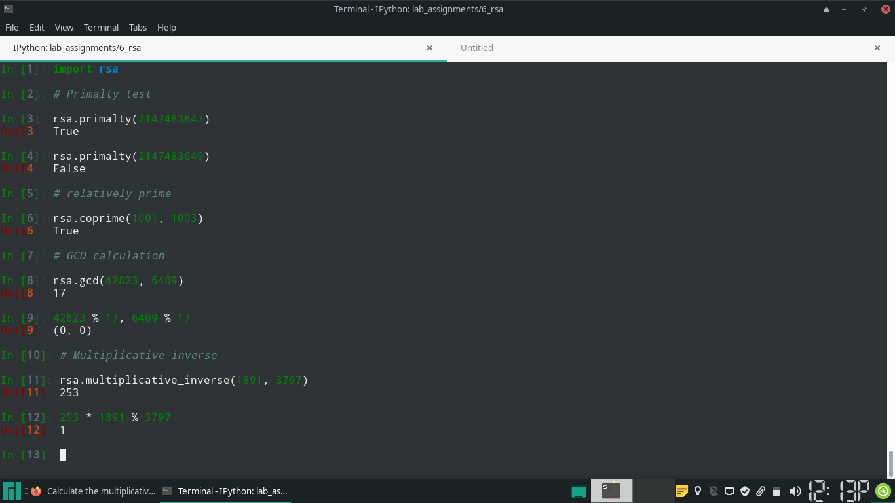
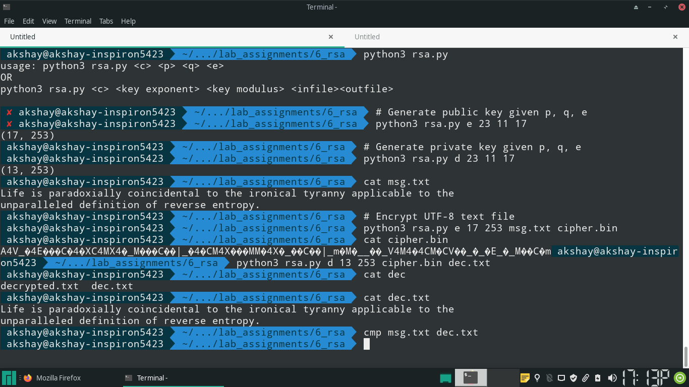
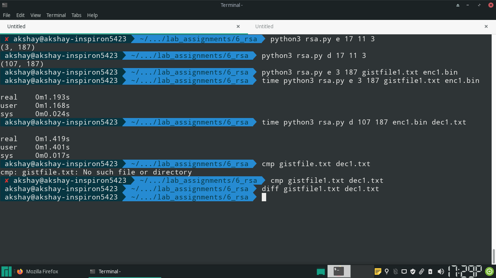
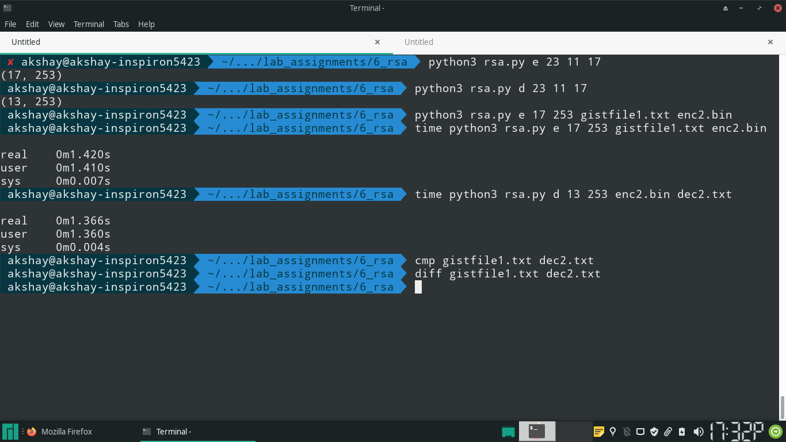
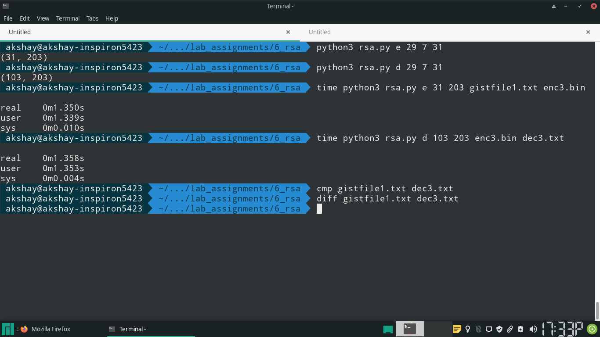

## Code

### 1 Check whether given number is prime or not?

\small
```{.py}
# Check whether given integer is prime, using the Fermat's test as a heuristic,
# then doing simple division checks
def primalty(n):
    # eliminate possibility of number being even
    if n == 2:
        return True
    elif n % 2 == 0:
        return False

    # Fermat's test
    a = n - 1 # always co prime to n
    test_result = pow(a, n - 1, n) # (a ^ (n - 1)) % n

    if test_result != 1:
        # not prime
        return False

    divisor = 3
    while divisor * divisor <= n:
        if n % divisor == 0:
            return False
        divisor += 1

    return True
```
\normalsize

### 2 find GCD(Greatest Common Divisor) or given two numbers

\small
```{.py}
# Finds the gcd of two given positive integers 
# Uses euclid's method
# does not work if both the inputs are 0
def gcd(a, b):
    smaller = min(a, b) 
    larger = max(a, b)

    while smaller != 0:
        smaller, larger = larger % smaller, smaller

    return larger
```
\normalsize

### 3 check whether given numbers are relatively prime or not?

\small
```{.py}
# checks whether a and b are co-prime
def coprime(a, b):
    return gcd(a, b) == 1

```
\normalsize

### 4 find multiplicative inverse of given two numbers

\small
```{.py}
# finds the coefficients of a, b in expression where they express GCD as their
# linear combination
# requires that a > b
def extended_euclidian(a, b):
    old_r, r = a, b
    old_s, s = 1, 0
    old_t, t = 0, 1

    while r != 0:
        # old_r, r form the current pair

        q = old_r // r
        old_r, r = r, old_r - q * r

        # calculate new Bezout coefficients using the old coefficients
        old_s, s = s, old_s - q * s
        old_t, t = t, old_t - q * t


    return old_r, old_s, old_t

# finds (a ^ (-1)) % n
def multiplicative_inverse(a, n):
    remainder, coeff_n, coeff_a = extended_euclidian(n, a)

    assert remainder == 1

    # 1 = coeff_n * n + coeff_a * a

    return coeff_a if coeff_a > 0 else (coeff_a + n)
```
\normalsize

### Output of independent execution of helper functions



\pagebreak

### 5 implement RSA algorithm
\small
```{.py}
# encrypts or decrypts single byte (operation is common)
def rsa_process(msg, key):
    exp, n = key

    # (msg ^ exp) % n
    return pow(msg, exp, n)
```
\normalsize

## Complete Code

\small
```{.py}

# Write a program to
# 1)check whether given number is prime or not?
# 2)find GCD (Greatest Common Divisor) of given two numbers.
# 3)check whether given numbers are relatively prime or not?
# 4)find multiplicative inverse of given two numbers
# 5)implement RSA algorithm
# Compute the time required for encryption and decryption.


# Check whether given integer is prime, using the Fermat's test as a heuristic,
# then doing simple division checks
def primalty(n):
    # eliminate possibility of number being even
    if n == 2:
        return True
    elif n % 2 == 0:
        return False

    # Fermat's test
    a = n - 1 # always co prime to n
    test_result = pow(a, n - 1, n) # (a ^ (n - 1)) % n

    if test_result != 1:
        # not prime
        return False

    divisor = 3
    while divisor * divisor <= n:
        if n % divisor == 0:
            return False
        divisor += 1

    return True

# Finds the gcd of two given positive integers 
# Uses euclid's method
# does not work if both the inputs are 0
def gcd(a, b):
    smaller = min(a, b) 
    larger = max(a, b)

    while smaller != 0:
        smaller, larger = larger % smaller, smaller

    return larger

# checks whether a and b are co-prime
def coprime(a, b):
    return gcd(a, b) == 1


# finds the coefficients of a, b in expression where they express GCD as their
# linear combination
# requires that a > b
def extended_euclidian(a, b):
    old_r, r = a, b
    old_s, s = 1, 0
    old_t, t = 0, 1

    while r != 0:
        # old_r, r form the current pair

        q = old_r // r
        old_r, r = r, old_r - q * r

        # calculate new Bezout coefficients using the old coefficients
        old_s, s = s, old_s - q * s
        old_t, t = t, old_t - q * t


    return old_r, old_s, old_t

# finds (a ^ (-1)) % n
def multiplicative_inverse(a, n):
    remainder, coeff_n, coeff_a = extended_euclidian(n, a)

    assert remainder == 1

    # 1 = coeff_n * n + coeff_a * a

    return coeff_a if coeff_a > 0 else (coeff_a + n)


# encrypts or decrypts single byte (operation is common)
def rsa_process(msg, key):
    exp, n = key

    # (msg ^ exp) % n
    return pow(msg, exp, n)

# returns nothing, encrypts bytes array consisting of ASCII characters
def process_wrapped(char_array, key):
    n = len(char_array)
    for i in range(n):
        char_array[i] = rsa_process(int(char_array[i]), key)


if __name__ == "__main__":

    from sys import argv, stderr
    n = len(argv)

    if n == 5:
        # rsa.py <c> <p> <q> <e>
        __, c, p, q, e = argv

        p = int(p)
        q = int(q)
        e = int(e)

        n = p * q
        if n < 128 or n > 256:
            print("128 <= n < 256 required", file = stderr)
            exit(1)

        m = (p - 1) * (q - 1)

        if e > m:
            print("e < (p - 1) * (q - 1) required", file = stderr)
            exit(2)

        if c == "e":
            # present the encryption key
            print("({}, {})".format(e, n))
        elif c == "d":
            # present the decryption key
            d = multiplicative_inverse(e, m)
            print("({}, {})".format(d, n))

        exit()

    if n != 6:
        print("usage: python3 rsa.py <c> <p> <q> <e>\n"\
              "OR\n"\
              "python3 rsa.py <c> <key exponent> <key modulus> <infile>"\
              "<outfile>\n", file = stderr)

        exit(3)

    
    __, c, k, n, infile, outfile = argv

    k = int(k)
    n = int(n)

    # NOTE:
    # The plaintext should always be UTF-8- the MSB is reserved
    # this is because the ciphertext is a number in range (0, n).
    # If 0-255 were allowed in plaintext, then the ciphertext might 
    # have a value greater than 255
    # If n > 255, then the size of the ciphertext will be more than 1 byte!
    #
    # tl;dr
    # plaintext should be UTF-8 1 byte
    # p * q should be in range (128, 256]

    if c == 'e'or c == 'd':
        with open(infile, 'rb') as fi:
            with open(outfile, 'wb') as fo:
                # convert the file to a mutable array
                data_array = bytearray(fi.read())

                # encrypt / decrypt each byte in mutable array independently using the key
                # given
                process_wrapped(data_array, (k, n))
                fo.write(data_array)
    else:
        print("<c> has to be 'e' or 'd'", file = stderr)

```
\normalsize

## Output









\pagebreak

## Statistics

The file used for encryption is an ASCII text file having size **1 MB**

The average time needed for encryption (3 repetionts, different keys each time)
is **1.30s**

The average time needed for decryption (3 repetitions, different keys each time)
is  **1.37s**

## Notes
- The encryption input is restricted to characters whose binary encoded value is
  < 128

- p and q must be such that 
	128 < p * q <= 256

- This is done to avoid the problem of ciphertext size being different from
  plaintext size. 

- The last bit in the byte can be considered as *padding*

- The time required for encryption or decryption depends on the exponent- this
  is the reason why the decryption time is more- the keys were such that the
  exponent in the public key was lesser than the one in the private key, or the
  two were almost equal
