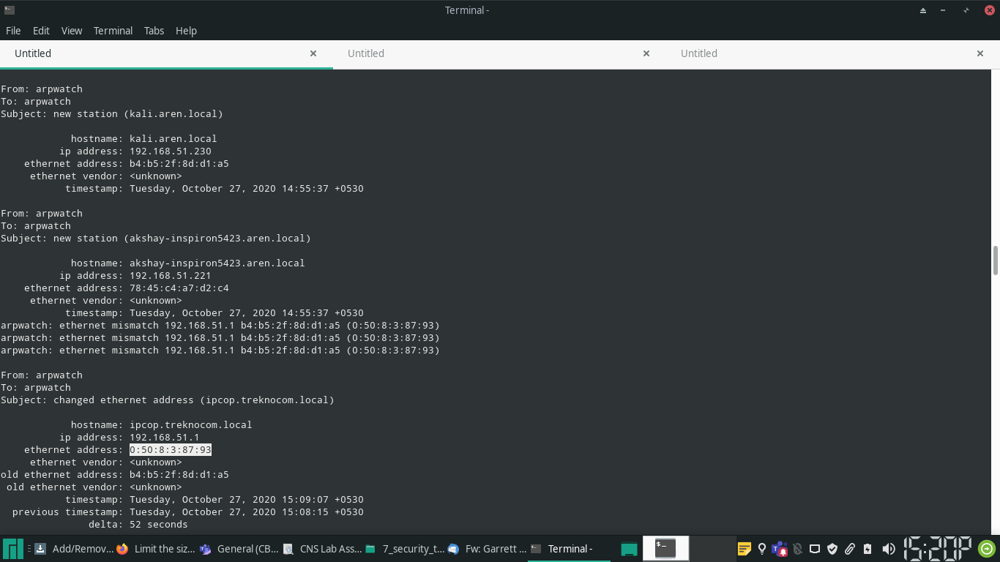
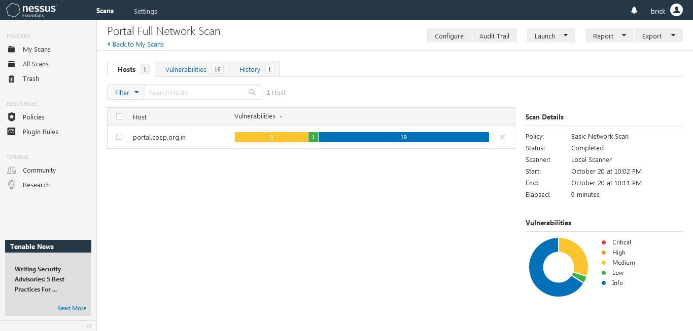
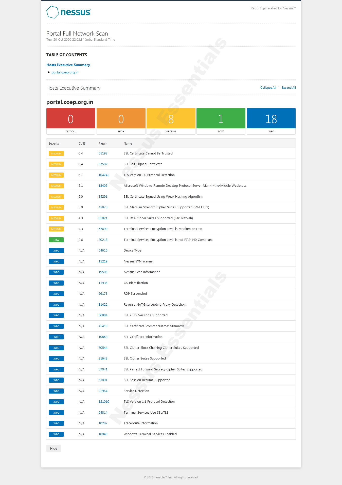

# ARP Spoofing

- ARP (Address Resolution Protocol) is a protocol used by hosts for discovering
  the Link Layer Address (usually MAC) corresponding to a known IP address.

- ARP provides *hardware addresses* and is used on a LAN. A host on a LAN
  requires the hardware address of the host which it wants to send a frame to. 

- Because the source host does not know the hardware address of the destination
  host, it **broadcasts** an ARP frame to all hosts within the LAN. For example,
  if the host's MAC is XYZ, and the destination IP address is ABC, it broadcasts
  a packet of form

	"Who has ABC? tell XYZ"

- When someone resolves the IP address, the source host accepts the resolution
  *without authentication*, and begins to send frames meant for the destination
  IP address to the hardware address recorded in it's tables.
- Furthermore, ARP is stateless, which means that the source host does not keep
  track of ARP requests which it sends. So if a host recieves an ARP reply, it
  assumes it's validity without authentication, and replaces the corresponding
  entry in it's tables. This cached entry is then used by the host till it
  expires.

- The nature of ARP (described above) renders it vulnerable to an attack called
  ARP spoofing.

- ARP spoofing is a technique used by a malicious host in which it sends spoofed
  ARP replies onto a local area network, with an aim of associate it's own
  hardware address with the IP address of some other host.

- If this succeeds, then the malicious host will be sent all the traffic which
  is meant for some other host.
  
- Using this, the malicious host may do any of the following:
 1.  Denial of Service (traffic does not reach the intended host)
 2. Man-in-the-Middle (the malicious host modifies data before forwarding it)

## TL;DR

1. **What is ARP Spoofing?**

- A technique used by a malicious host to associate it's hardware address to
the IP address of another host

2. **How it happens?**

- The malicious host sends spoofed ARP reply packets, which causes other hosts
to update their IP:MAC tables without authentication.

3. **In which network?**

- Happens on a Local Area Network.

4. **possible attacks with ARP Spoofing**

- Denial of Service
- Session Hijacking
- Man in the Middle

# Types of Vulnerabilities detected by Nessus

Nessus is a client server vulnerability scanner. It provides a number of
plugins, each of which scans for a specific type of vulnerability. Nessus
provides built-in tempalates of network scans which use subsets of these
plugins, or allows custom scans where the user can choose plugins.

## Vulnerability Types

1. Unauthorized access to sensitive data, or control over system

2. Misconfiguration vulnerabilities

3. Absence of passwords, or use of default passwords.
 - Nessus checks for default passwords for various types of web applications,
   and can also launch an attack using a dictionary.

4. Denial of Service

5. Vulnerabilities related to, updated to include recent exploits.
 - Operating Systems
 - Databases
 - Web Servers
 - Network devices

6. Patch levels.
 - Vendors release updates for their software from time to time for fixing
   newly published exploits. Nessus detects whether these patches have been
   applied.

# What is ARPWatch tool and Nessus Tool?

\small
| Name of Tool | Open Source / Commercial      | Supported OS     | Features / Functionality                                                                                          | Drawbacks                                                                                                                         |
|--------------|-------------------------------|------------------|-------------------------------------------------------------------------------------------------------------------|-----------------------------------------------------------------------------------------------------------------------------------|
|arp- watch    | Open Source, BSD       | Linux, BSD     | Track IP-MAC pairings, notify user via email when there is a change, uses *pcap* for tapping the ethernet traffic | Cannot **detect** that a particular change is due to spoofing or genuine- just reports the change                                 |
|			   |						       |			      |
                                                   |  
												   	|
|Nessus       | Proprietary, Version 2 is GPL | Windows, Linux | Network Vulnerability Scanner, can scan a host, and the network associated with it, automated research generation | Is intrusive, may cause network errors, reports false positives, does not discover SQL injection attacks or buisness logic errors |
\normalsize

# Screenshots of ARPWatch Tools used to detect ARP Spoofing, or Nessus to find nework vulnerabilities

## ARPWatch

The screenshots are of the following scenario:

1. akshay-inspiron5423.aren.local or 192.168.51.221 has MAC 78:45:c4:a7:d2:c4
2. kali.aren.local or 192.168.51.230 has MAC b4:b5:2f:8d:d1:a5
3. The gateway ipcop.treknocom.local has MAC 0:50:8:3:87:93

kali.aren.local now starts a man in the middle attack using ARP spoofing (with
ettercap), trigerring flip-flop messages by arpwatch.

**There is a change in MAC address corresponding to 192.168.51.1 from 0:50:8:3:87:93 to b4:b5:2f:8d:d1:a5.**

**There are futher flip flops back to the correct MAC, and again to the spoofed
MAC, as both the gateway and the intruder send ARP replies**

\pagebreak

## Nessus

